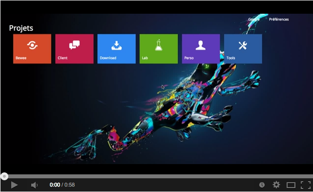

# Home

## Demonstration

[](http://www.youtube.com/watch?v=3djU7v5ytMU)

## Installation 

Pour l'installer rien de plus simple ! 

[Téléchargez le zip](https://github.com/RomainJeff/Home/archive/dev.zip)

Décompressez le avec le logiciel de votre choix.

Déposez les fichiers ``` index.php ``` et ``` wamp_homepage/ ``` à la racine de votre dossier ``` www/ ``` 

voilà vous pouvez désormais profiter de Home !